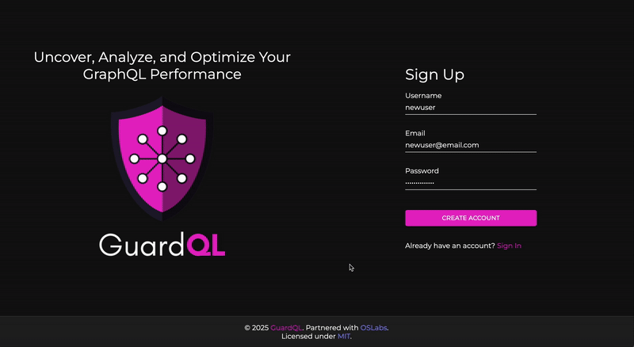
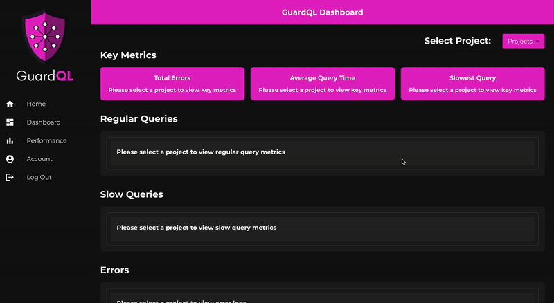

<p align="center">
  
</p>

# GuardQL

### Uncover, Analyze, and Optimize Your GraphQL Performance

GuardQL is a debugging and performance monitoring tool that logs GraphQL API errors, tracks slow query execution times, and provides a central dashboard with search and filtering functionality for multiple projects.

<!-- To be inserted:
screenshots, more details about product, acknowledgements, instructions
-->
<details>
  <summary>Table of Contents</summary>
  
  - [Technologies](#technologies)
  - [Introduction](#introduction)
  - [Features](#features)
  - [Initial Set-up and Installation](#initial-set-up-and-installation)
  - [Contributions](#contributions)
  - [GuardQL Team](#guardql-team)
  - [Contact Us](#contact-us)
  - [License](#license)
  - [Acknowledgements](#acknowledgements)

</details>

## Technologies
<!-- Backend -->


 <!-- Frontend --> 


## Introduction 

Debugging GraphQL APIs can be difficult, especially when trying to pinpoint errors in slow or inefficient queries. GuardQL streamlines this process by providing a comprehensive debugging and performance monitoring tool that:

- ✅ Captures GraphQL API errors in real-time with detailed logs
- ✅ Monitors query execution times to detect inefficiencies
- ✅ Offers an intuitive dashboard for visualizing key performance metrics
- ✅ Enables users to create and manage multiple projects with a dropdown selection

With GuardQL, developers gain real-time visibility into their GraphQL queries, making it easier to diagnose issues and optimize performance.

## Features

#### 🚨 Real-time GraphQL Error Tracking & Debugging
* Instant Error Logging: Captures GraphQL API errors as they occur, complete with timestamps and detailed error messages.
* Query & Mutation Context: Provides full visibility into which GraphQL query or mutation caused the error, along with stack trace details.

#### 🎯 Performance Monitoring & Query Optimization
* Slow Query Identification: Automatically flags GraphQL queries that take longer than a set threshold, helping pinpoint performance bottlenecks.
* Comprehensive Query Performance Tracking: Logs execution times for all queries, not just slow ones, offering a complete overview of GraphQL performance.

#### 📊 Intuitive & Insightful Dashboard
* User-Friendly Interface: Built for fast debugging and troubleshooting with a clean, easy-to-navigate UI.
* Visual Performance Analytics: Displays query execution trends and error frequency over time through graphical reports.

#### 🚀 Seamless GraphQL Integration via NPM Plugin
* Effortless Setup: A lightweight NPM package that integrates smoothly into any GraphQL project with minimal configuration.
* Automated Logging: Instantly starts tracking errors and performance metrics without requiring additional setup.

## Initial Set-up and Installation

#### 1️⃣ Sign Up & Get Your API Key
* Create an account to gain access to the GuardQL Dashboard.
* Upon signup, you'll receive a unique API key, which is required for configuring the plugin. 
 

#### 2️⃣ Create & Select a Project
* Inside the dashboard, create a new project using the project dropdown.
* Select your project to start tracking GraphQL request performance and error logs.


#### 3️⃣ Install the GuardQL NPM Package
* Add GuardQL to your application by running:
    `npm install guardql`

#### 4️⃣ Configure the Plugin in Apollo Server
* Integrate GuardQL into your Apollo Server setup by adding the plugin and providing:
    * Your project name
    * The API key from your dashboard
    * Any query execution time thresholds for slow query detection
    ```import { ApolloServer } from '@apollo/server';
       import { guardqlPlugin } from 'guardql';
        
        const server = new ApolloServer({
        typeDefs,
        resolvers,
        plugins: [
            guardqlPlugin({
                apiKey: 'your-api-key',
                projectName: 'your-project-name',
                slowQueryThreshold: 1000 // in milliseconds
            })
        ]
    });```

#### 5️⃣ Run Your Application
* Start your server and begin making GraphQL requests as usual.

#### 6️⃣ Monitor Your API in Real-Time
* Access the GuardQL Dashboard to track:
    * Query execution times
    * GraphQL errors with stack traces
    * Performance trends and slow query alerts

## Contributions

We welcome contributions!

If you’d like to contribute: 

1. Fork this repository
2. Create a feature branch 
    - `git checkout -b feature-branch-name`
3. Commit your changes
    - `git add .`
    - `git commit -m "Added new feature XYZ"`
4. Push to your branch
    - `git push origin feature-branch-name`
5. Create a pull request

For major changes, please open an issue first to discuss what you’d like to change.

## GuardQL Team
---
<!-- Nico Henry -->
 [](https://github.com/Nico21221) [](https://www.linkedin.com/in/nico-henry/)
<!-- Cindy Rodriguez-Llivipuma -->
 [](https://github.com/csrl23) [](https://www.linkedin.com/in/cindy-rod-lliv/)
<!-- Sienna Shepherd -->
 [](https://github.com/codecaptaincode) [](https://www.linkedin.com/in/sienna-shepherd/)
<!-- Sabrina Ira -->
 [](https://github.com/sabrinaira) [](https://www.linkedin.com/in/sabrinaira)
<!-- Mike Thurstlic -->
 [](https://github.com/thurstlic7) [](https://www.linkedin.com/in/mike-thurstlic-a2b8a82a4/)


<!-- - **Nico Henry** - [@Nico21221](https://github.com/Nico21221)
- **Cindy Rodriguez-Llivipuma** - [@csrl23](https://github.com/csrl23)
- **Sienna Shepherd** - [@codecaptaincode](https://github.com/codecaptaincode)
- **Sabrina Ira** - [@sabrinaira](https://github.com/sabrinaira)
- **Mike Thurstlic** - [@thurstlic7](https://github.com/thurstlic7) -->

## Contact Us 
LinkedIn link

## License
Distributed under the [MIT](LICENSE.txt) License.

## Acknowledgements

We would like to thank the following resources that helped make GuardQL possible:

- **[Material-UI](https://mui.com/)** - Used for designing UI components
- **[Canva](https://www.canva.com/)** - Used to help create logo

Special thanks to the entire GuardQL team for their hard work and dedication into making GuardQL a reality! ✨

#### Return to [top](#guardql)